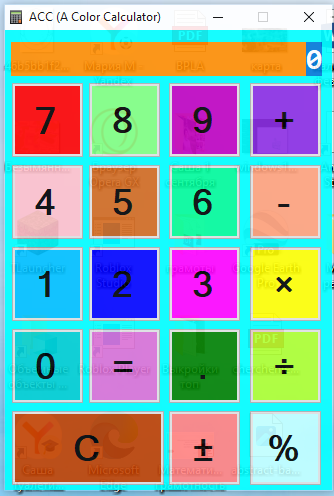

# 🎨 ACC - A Color Calculator

A simple and colorful calculator app built with **C#** and **Windows Forms**. It features a stylish glass-like transparent design with vibrant, multicolored buttons.

## ✨ What it does

- ➕ Add, subtract, multiply, and divide numbers
- 📊 Calculate percentages
- ➖ Toggle numbers between positive and negative
- ⚪ Use decimal points
- 🛡️ Shows an error if you try to divide by zero

## 🎨 Design

The calculator has a sleek, modern look. The background is dark and semi-transparent to create a "glass" effect. I used a variety of different colors for the buttons to make them bright, fun, and easy to tell apart.

## 🛠 How I made it

I wrote all the code in **SharpDevelop**. The interface was designed using the **Windows Forms designer**. I spent time picking the perfect colors for each button to make the calculator look exciting and not boring.

## 🚀 How to run it

### Option 1: Download the Ready-to-Run App
1. Go to the [Releases](https://github.com/sasha-adelser/ACC-A-Color-Calculator-/releases/tag/v.1) page.
2. Download the latest `ReleaseACC-v.1.zip` file.
3. Unzip it and double-click `ACC.exe` to run.

### Option 2: Build from Source
1. Clone the repository.
2. Open `Calculator.sln` in **SharpDevelop** or **Visual Studio**.
3. Press `F8` to build the solution.
4. Press `F5` to run.

## 📁 Project Files

- `MainForm.cs` - The main code with all the math logic.
- `MainForm.Designer.cs` - The file that defines the button layout.
- `Program.cs` - The starting point of the application.

## 🤔 Why I made this

I wanted to learn how to create Windows applications with clickable buttons and text boxes. A calculator seemed like the perfect first project because everyone knows how it works. I also wanted to practice making an attractive and colorful user interface.

## 👤 Author

This is one of my first programming projects. I'm an 11-year-old developer learning C#. I hope you like it!

**P.S.** I am still learning, so there might be a few bugs. Sorry about that!
